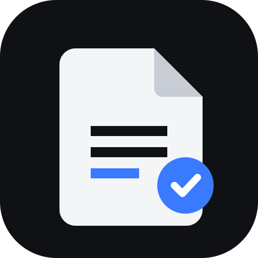
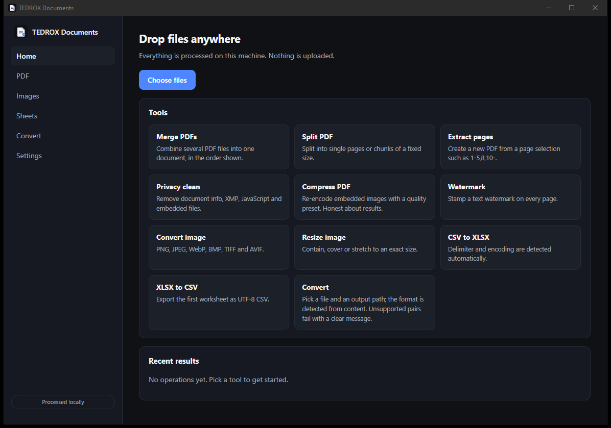
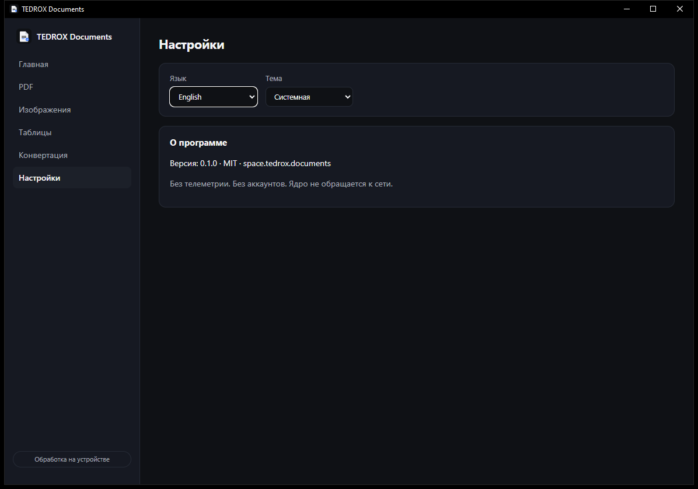
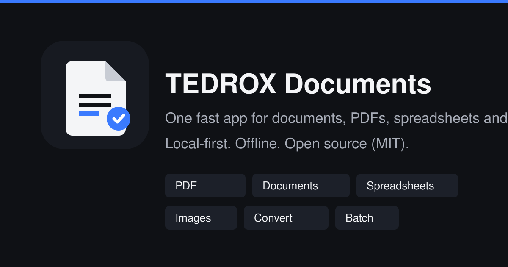

<p align="center">
  
</p>

<h1 align="center">TEDROX Documents</h1>

<p align="center">
  <strong>Your document toolbox. Offline. Fast. Open.</strong><br>
  PDF, Office documents, spreadsheets, images and conversions — processed locally on your machine.
</p>

<p align="center">
  <a href="https://github.com/hi77x/tedrox-documents/releases"></a>
  <a href="LICENSE"></a>
  <a href="https://github.com/hi77x/tedrox-documents/actions"></a>
  
</p>

<p align="center">
  <a href="https://documents.tedrox.space">Website</a> ·
  <a href="docs/cli.md">CLI documentation</a> ·
  <a href="docs/formats.md">Format support</a> ·
  <a href="ROADMAP.md">Roadmap</a>
</p>

---

## What it is

TEDROX Documents replaces the fragmented workflow of a PDF editor, a converter
website and a set of small office utilities with one native application built on
a shared Rust core. Everything runs locally: no uploads, no account, no queues,
no "free tier" limits.

The project is under active development. This repository already contains the
complete native engine, a scriptable CLI and automated release pipelines; the
desktop and Android shells are being built on top of the same core.

## Status

| Area | State |
| --- | --- |
| Rust core (`tdx-*` crates) | Working, tested |
| CLI `tdx-doc` | Working, tested, packaged |
| Windows build | Publishing with every release |
| Desktop shell (Tauri 2) | Working build; engine wired through 15 commands |
| Linux build | Builds from source; packages on the roadmap |
| Android shell | Planned; shared core is ready |
| Landing page | Live at [tedrot3u.tedrox.space](https://tedrot3u.tedrox.space); custom domain `documents.tedrox.space` pending DNS |

## Demo

Real output from the CLI on Windows:

```console
$ tdx-doc convert report.md -o report.pdf
Done in 208 ms (105 B in, 96 KB out)
  blocks: 5
  font: built-in Helvetica

$ tdx-doc pdf merge report.pdf appendix.pdf -o merged.pdf
Done in 1.29 s (188 KB in, 191 KB out)
  files: 2
  pages: 2

$ tdx-doc pdf clean merged.pdf -o clean.pdf
Done in 962 ms (191 KB in, 190 KB out)
  removed_entries: 2

$ tdx-doc csv to-xlsx data.csv -o data.xlsx
Done in 156 ms (48 B in, 5.3 KB out)
  sheet: Sheet1
```

### Desktop application

Real screenshots of the running desktop shell (Windows 10, application v0.1.0):

<p align="center">
  
  
</p>

<p align="center">
  
</p>

## Features

**PDF**
Merge · split · extract pages · delete pages · reorder · reverse · rotate ·
insert one PDF into another · odd/even extraction · duplicate pages ·
images → PDF · metadata viewer · metadata editor · privacy clean (Info, XMP,
JavaScript, embedded files, actions) · image re-compression presets ·
text watermark.

**Documents**
Markdown/txt → DOCX (native OOXML writer) · DOCX text and Markdown extraction ·
DOCX → PDF · HTML → PDF · Markdown → HTML · document statistics.
Legacy binary `.doc` import through the optional LibreOffice adapter.

**Spreadsheets and CSV**
CSV report with delimiter, encoding and type detection · CSV ↔ XLSX ↔ JSON ·
filter · sort · deduplicate · trim · select and rename columns · split by rows
or by field · join files · XLSX/XLS/ODS reading with sheet listing.

**Images**
PNG, JPEG, WebP, BMP, TIFF, AVIF conversion · resize (contain/cover/exact) ·
crop · rotate · flip · metadata stripping · SVG rasterization · PNG → SVG embed
mode · raster → SVG tracing (black & white, poster, photo) · ICO creation.

**Files**
ZIP creation and safe extraction (zip-slip and decompression-bomb protection) ·
SHA-256 hashing · duplicate detection · batch rename with dry-run.

## Supported formats

Capability matrix for the current release — only what is implemented is marked:

| Format | Open | Edit | Convert | Merge/Split | Notes |
| --- | --- | --- | --- | --- | --- |
| PDF | Yes | Metadata | Yes | Yes | Page rasterization needs the optional PDFium adapter |
| DOCX | Yes | Create | Yes | — | Native OOXML; complex layout is flattened in PDF export |
| Markdown / TXT | Yes | Yes | Yes | — | PDF export with system font embedding |
| HTML | Yes | — | Yes | — | Text-first rendering; scripts and CSS layout ignored |
| CSV / TSV | Yes | Yes | Yes | Split | Streaming parser, encoding detection |
| XLSX / XLS / ODS | Yes | — | XLSX → CSV | — | Reading via calamine; writing via rust_xlsxwriter |
| Images | Yes | Yes | Yes | — | SVG tracing is for logos and line art, not photos |
| ZIP | Yes | — | — | — | Safe extraction with limits |
| DOC / XLS (legacy) | Adapter | — | Adapter | — | Requires LibreOffice installed by the user |

## Download

Grab the latest build from [GitHub Releases](https://github.com/hi77x/tedrox-documents/releases):

- **Windows desktop app** — `TEDROX-Documents-0.1.1-x64-setup.exe` (installer with Start menu entry and uninstaller)
- **Windows command line** — `tdx-doc-windows-x86_64.zip` (portable `tdx-doc.exe`; run it from PowerShell or Windows Terminal)
- **Linux CLI** — `tdx-doc-linux-x86_64.tar.gz`; AppImage and `.deb` are on the roadmap
- **Android** — shell in development
- **Source** — `Source code (zip/tar.gz)` on the release page

Every release includes `SHA256SUMS.txt`. Code signing is not configured yet, so
Windows SmartScreen may warn on first run. Double-clicking `tdx-doc.exe` shows
usage instructions instead of silently closing.

## Quick start

```bash
# Merge and optimize PDFs
tdx-doc pdf merge a.pdf b.pdf -o merged.pdf
tdx-doc pdf split book.pdf --chunk 25 --out-dir out/
tdx-doc pdf compress report.pdf -o small.pdf --preset screen
tdx-doc pdf clean private.pdf -o clean.pdf

# Documents
tdx-doc convert notes.md -o notes.pdf
tdx-doc doc create contract.md -o contract.docx --title "Contract"
tdx-doc doc extract contract.docx -o contract.txt

# Spreadsheets
tdx-doc csv info data.csv
tdx-doc csv to-xlsx data.csv -o data.xlsx
tdx-doc csv transform data.csv -o clean.csv --trim --dedupe --sort score --desc

# Images
tdx-doc image convert logo.png --to webp -o logo.webp
tdx-doc image trace logo.png -o logo.svg --preset poster
tdx-doc image svg-render icon.svg -o icon.png --width 512

# Files
tdx-doc archive zip project/ -o project.zip
tdx-doc file hash *.pdf
tdx-doc inspect anything --json
tdx-doc tools
```

Run `tdx-doc --help` or see [docs/cli.md](docs/cli.md) for the full reference.
Add `--json` to any command for machine-readable output.

## Privacy

- No file ever leaves the machine that runs the command or the app.
- No telemetry, no analytics, no crash reporting.
- Logs contain operation ids, file types, sizes, durations and sanitized error
  categories — never document contents, extracted text or passwords.
- Outputs are written atomically and verified before replacing anything.
- See [PRIVACY.md](PRIVACY.md) and [SECURITY.md](SECURITY.md).

## Architecture

A shared Rust core with thin shells on top:

```text
apps/desktop (in development)     apps/web (landing)
        │                               │
crates/tdx-cli (tdx-doc) ── crates/tdx-convert
        │                        │
        ├─ tdx-pdf   (lopdf)     ├─ tdx-docx (OOXML)
        ├─ tdx-image (image,     └─ tdx-sheet (csv, calamine,
        │            resvg, vtracer)           rust_xlsxwriter)
        ├─ tdx-archive (zip)
        ├─ tdx-jobs (queue, cancellation, progress)
        └─ tdx-core (detection, registry, errors, atomic IO)
```

Every operation is exposed through the same capability registry with inputs,
outputs, cost class, cancellation support and platform availability, so the
CLI, desktop shell and future plugins share one implementation. See
[ARCHITECTURE.md](ARCHITECTURE.md).

## Build from source

Prerequisites: Rust stable (1.80+), Node.js 20+ for the landing page tools.

```bash
git clone https://github.com/hi77x/tedrox-documents
cd tedrox-documents

cargo build --release -p tdx-cli     # produces target/release/tdx-doc
cargo test --workspace               # unit + integration tests
node scripts/license-audit.mjs       # dependency license gate
node scripts/sync-i18n.mjs           # dictionary completeness check
```

Detailed platform notes: [docs/build.md](docs/build.md),
[docs/windows.md](docs/windows.md), [docs/linux.md](docs/linux.md),
[docs/android.md](docs/android.md).

## Localization

English is the canonical language; Russian is fully supported. Dictionaries
live in [packages/i18n](packages/i18n) and are validated by CI — every English
key must exist in Russian with no orphans. See
[docs/localization.md](docs/localization.md).

## Roadmap

- Desktop shell (Tauri 2) with the same operation registry
- Linux AppImage and `.deb` packages
- Android shell with Storage Access Framework
- PDF page rasterization through the optional PDFium adapter
- True redaction pipeline with verification
- Font subsetting for smaller generated PDFs
- Batch queue UI and operation presets

See [ROADMAP.md](ROADMAP.md) for details.

## Contributing

Issues and pull requests are welcome. Read [CONTRIBUTING.md](CONTRIBUTING.md)
and [CODE_OF_CONDUCT.md](CODE_OF_CONDUCT.md) before starting. Security reports
go through [SECURITY.md](SECURITY.md).

## License

MIT — see [LICENSE](LICENSE). Third-party attributions are listed in
[THIRD_PARTY_LICENSES.md](THIRD_PARTY_LICENSES.md).
