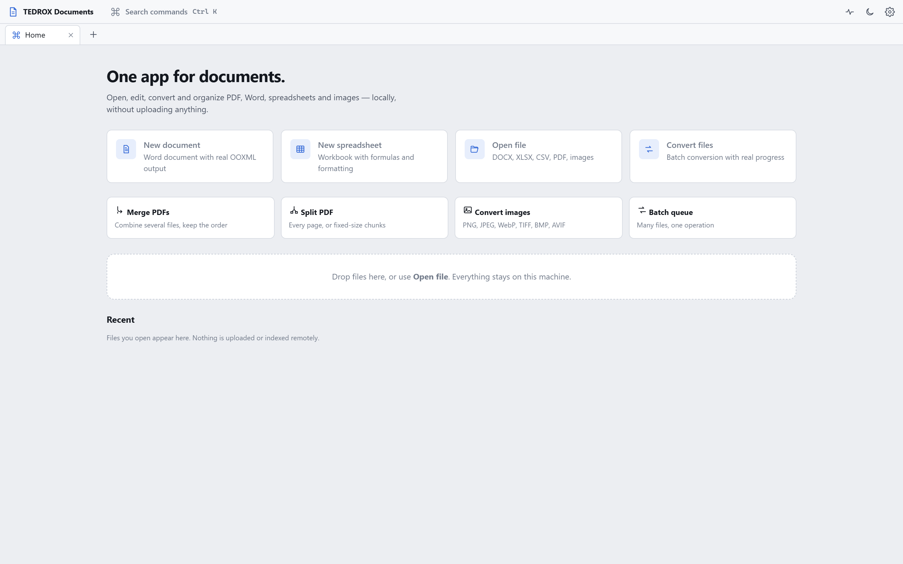
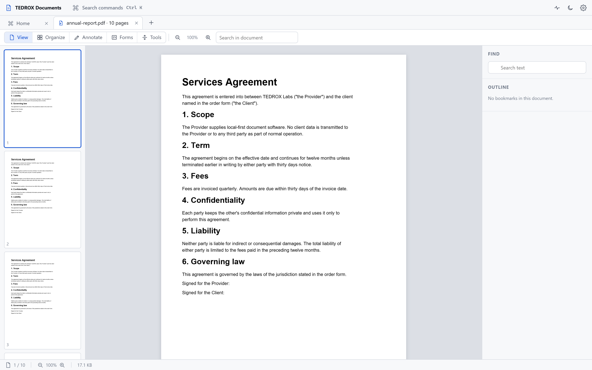
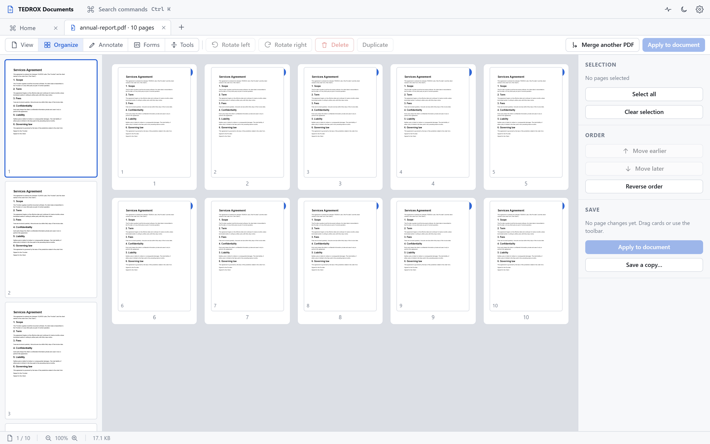
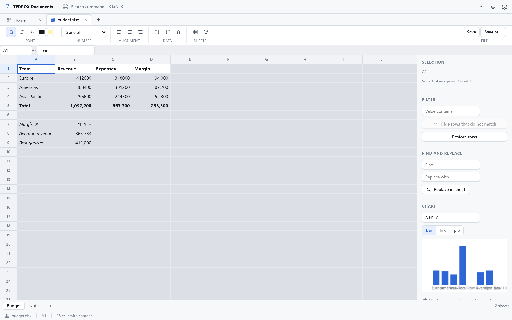
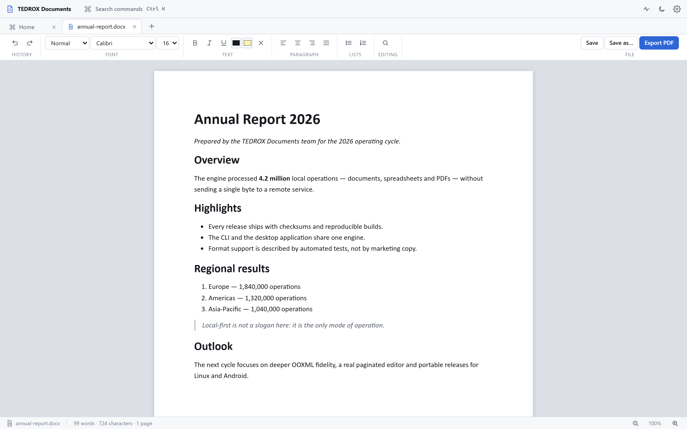

<p align="center">
  
</p>

<h1 align="center">TEDROX Documents</h1>

<p align="center">
  <strong>One app for documents.</strong><br>
  Open, edit, convert and organize PDF, Word, spreadsheets and images — locally.
</p>

<p align="center">
  <a href="https://github.com/hi77x/tedrox-documents/releases"></a>
  <a href="LICENSE"></a>
  <a href="https://github.com/hi77x/tedrox-documents/actions"></a>
  
</p>

<p align="center">
  <a href="https://documents.tedrox.space">Website</a> ·
  <a href="docs/cli.md">CLI documentation</a> ·
  <a href="docs/formats.md">Format support</a>
</p>

---

## What it is

TEDROX Documents is a local-first office suite built on one Rust engine with a
Tauri 2 desktop shell on top. The same engine powers the graphical application
and the `tdx-doc` command line, so a conversion scripted in CI produces exactly
the same bytes as the same operation in the window.

Everything runs on the machine you are using: no uploads, no account, no
queues, no "free tier" limits.

## Screenshots

Real captures of the application, generated headlessly from production
components (see `scripts/capture-screenshots.mjs`).

<p align="center">
  
  
  
  
  
</p>

## Workspaces

**Home** — recent and pinned files, new document, new spreadsheet, open file,
drag and drop, batch conversion shortcuts.

**PDF** — open an existing PDF and read it in a continuous, zoomable canvas with
page thumbnails, text selection, search with match navigation, document outline
and metadata.
- Organize: drag to reorder, rotate, delete, duplicate, reverse, extract, split,
  merge another document in, export pages as PNG.
- Annotate: highlight, underline, strike out, freehand ink, text boxes, comments,
  rectangles, ellipses, arrows, colour and opacity. Annotations are written as
  real PDF annotation objects with appearance streams.
- Forms: read AcroForm fields and fill them, including check boxes and choice
  fields.
- Tools: compression presets, privacy clean (Info, XMP, JavaScript, embedded
  files, launch actions), text watermark.
- Saving is atomic and verified: the output is written to a sibling temporary
  file and only replaces the original after it re-opens successfully.

**Writer** — real OOXML round-trip. Headings, fonts, sizes, bold, italic,
underline, colour, highlight, alignment, bullet and numbered lists, quotes,
find and replace, live pagination with page boundaries, word count and PDF
export.

**Sheets** — workbooks with multiple sheets, a virtualized grid, a real formula
engine, number formats, alignment, fill colours, sorting, filtering, duplicate
removal and data-bound charts.

**Convert** — type detection, per-file operation lists and batch runs over many
files with progress, cancellation and a report. Images have their own tab for
format conversion, resizing, rotation, cropping and metadata stripping.

## Formula engine

The evaluator is a tokenizer and recursive-descent parser over the Excel
grammar, with dependency tracking and circular-reference detection. Supported
functions include:

`SUM` `SUMIF` `SUMIFS` `SUMPRODUCT` `COUNT` `COUNTA` `COUNTBLANK` `COUNTIF`
`COUNTIFS` `AVERAGE` `AVERAGEIF` `AVERAGEIFS` `MIN` `MAX` `MEDIAN` `STDEV`
`IF` `IFS` `SWITCH` `AND` `OR` `XOR` `NOT` `IFERROR` `IFNA` `ABS` `SIGN` `ROUND`
`ROUNDUP` `ROUNDDOWN` `INT` `TRUNC` `MOD` `POWER` `SQRT` `EXP` `LN` `LOG`
`LOG10` `PI` `CEILING` `FLOOR` `LEFT` `RIGHT` `MID` `LEN` `TRIM` `CLEAN` `LOWER`
`UPPER` `PROPER` `CONCAT` `CONCATENATE` `TEXTJOIN` `FIND` `SEARCH` `SUBSTITUTE`
`REPLACE` `REPT` `VALUE` `TEXT` `DATE` `TIME` `TODAY` `NOW` `YEAR` `MONTH` `DAY`
`HOUR` `MINUTE` `WEEKDAY` `DAYS` `EDATE` `ROW` `COLUMN` `ROWS` `COLUMNS` `INDEX`
`MATCH` `VLOOKUP` `HLOOKUP` `XLOOKUP` `OFFSET`

Every function above is covered by assertions in
`apps/desktop/scripts/formula-tests.mjs`, which run in CI. `FILTER`, `SORT` and
`UNIQUE` need array spill and are therefore **not** implemented — they return
`#NAME?` instead of a wrong answer.

## CLI

`tdx-doc` exposes the same engine without a GUI.

```console
$ tdx-doc convert report.md -o report.pdf
$ tdx-doc pdf merge a.pdf b.pdf -o merged.pdf
$ tdx-doc pdf compress report.pdf -o small.pdf --preset screen
$ tdx-doc pdf clean private.pdf -o clean.pdf
$ tdx-doc csv to-xlsx data.csv -o data.xlsx
$ tdx-doc image trace logo.png -o logo.svg --preset poster
$ tdx-doc inspect anything --json
```

Run `tdx-doc --help` or see [docs/cli.md](docs/cli.md).

## Format support

Only what is implemented is listed; the capability levels are derived from the
test suite.

| Format | Open | Edit | Export | Notes |
| --- | --- | --- | --- | --- |
| PDF | Yes | Pages, annotations, forms | Yes | Rendered with PDF.js in the shell; page operations use the Rust engine |
| DOCX | Yes | Yes | DOCX, PDF, TXT, Markdown | Paragraph, character and list formatting; complex layout is flattened in PDF export |
| Markdown / TXT | Yes | Yes | DOCX, PDF, HTML | |
| HTML | Yes | — | PDF | Text-first rendering; scripts and CSS layout are ignored |
| CSV / TSV | Yes | Yes | XLSX, JSON, CSV | Streaming reader with encoding and delimiter detection |
| XLSX / ODS | Yes | Yes | XLSX, CSV | Values, formulas and TEDROX formatting round-trip; formatting applied by other applications is not read back and the editor warns before overwriting it |
| Images | Yes | Yes | PNG, JPEG, WebP, TIFF, BMP, AVIF, ICO, SVG trace | |
| ZIP | Yes | — | Yes | Safe extraction with zip-slip and decompression-bomb protection |
| DOC / XLS (legacy) | Adapter | — | Adapter | Requires LibreOffice installed by the user |

Not implemented, and therefore not offered anywhere in the interface: PDF →
DOCX reconstruction, true redaction, cryptographic signing, OCR, pivot tables,
macros. The engine never executes document scripts or Office macros.

## Download

Grab the latest build from [GitHub Releases](https://github.com/hi77x/tedrox-documents/releases):

- **Windows desktop app** — NSIS installer with a Start menu entry
- **Windows CLI** — portable `tdx-doc.exe`
- **Linux CLI** — `tdx-doc-linux-x86_64.tar.gz`
- **Source** — build it yourself, see below

Every release includes `SHA256SUMS.txt`. Code signing is not configured yet, so
Windows SmartScreen may warn on first run.

## Build from source

Prerequisites: Rust stable (1.80+), Node.js 20+.

```bash
git clone https://github.com/hi77x/tedrox-documents
cd tedrox-documents

cargo build --release -p tdx-cli     # produces target/release/tdx-doc
cargo test --workspace               # engine tests

cd apps/desktop
npm ci
npm run build                        # typecheck + production bundle
npm test                             # formula engine assertions
```

Platform notes: [docs/build.md](docs/build.md),
[docs/windows.md](docs/windows.md), [docs/linux.md](docs/linux.md),
[docs/android.md](docs/android.md).

## Privacy

- No file ever leaves the machine that runs the command or the application.
- No telemetry, no analytics, no crash reporting.
- Logs contain operation ids, file types, sizes, durations and sanitized error
  categories — never document contents, extracted text or passwords.
- Outputs are written atomically and verified before replacing anything.
- See [PRIVACY.md](PRIVACY.md) and [SECURITY.md](SECURITY.md).

## Architecture

```text
 apps/desktop (Tauri 2 shell + React workspaces)
        │
 crates/tdx-cli (tdx-doc) ── crates/tdx-convert
        │                        │
        ├─ tdx-pdf   (lopdf)     ├─ tdx-docx (OOXML)
        ├─ tdx-image (image,     └─ tdx-sheet (csv, calamine,
        │            resvg, vtracer)           rust_xlsxwriter)
        ├─ tdx-archive (zip)
        ├─ tdx-jobs (queue, cancellation, progress)
        └─ tdx-core (detection, registry, errors, atomic IO)
```

The interface contains no document parsing logic: the shell calls engine APIs,
and every operation is described once in the capability registry with honest
inputs, outputs, cost class and cancellation support. See
[ARCHITECTURE.md](ARCHITECTURE.md).

## Contributing

Issues and pull requests are welcome. Read [CONTRIBUTING.md](CONTRIBUTING.md)
and [CODE_OF_CONDUCT.md](CODE_OF_CONDUCT.md) before starting. Security reports
go through [SECURITY.md](SECURITY.md).

Repository hygiene is enforced: internal planning documents are rejected by
`scripts/check-repo-hygiene.mjs` in CI and must stay outside the repository.

## License

MIT — see [LICENSE](LICENSE). Third-party attributions are listed in
[THIRD_PARTY_LICENSES.md](THIRD_PARTY_LICENSES.md).
